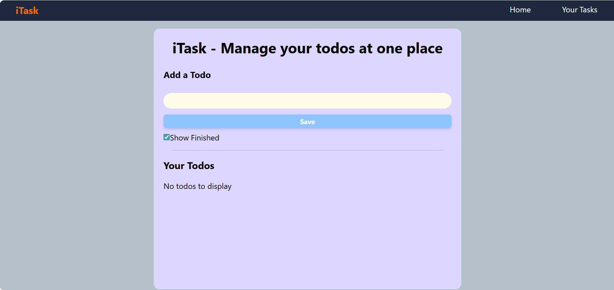

# 📝 iTask - React To-Do App

A responsive and minimalist **To-Do List App** built with **ReactJS** and **TailwindCSS** that helps users manage their daily tasks efficiently. Add, delete, and mark tasks as complete with a clean UI experience.

---

## 🚀 Features

-  Add new tasks with title and description
-  Mark tasks as complete or incomplete
-  Delete tasks
-  Mobile responsive design using Tailwind CSS
-  Saves tasks to `localStorage`

---

## 🛠️ Tech Stack

- ⚛️ React JS
- 🎨 Tailwind CSS
- 🔧 JavaScript (ES6+)
- 💡 localStorage

---

## 📷 Screenshots

  

---

